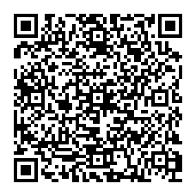

# Voorbeeld QRCode

> Open deze apart als het scannen niet lukt [hier](./student-qrcode.png).



De JSON-gecodeerde data van de QRCode, inclusief de base64-gecodeerde public key, is als volgt:
```json
{
    "student": "s1234567",
    "assignment": "OPD12345",
    "rubric": "REQ1"
}
```